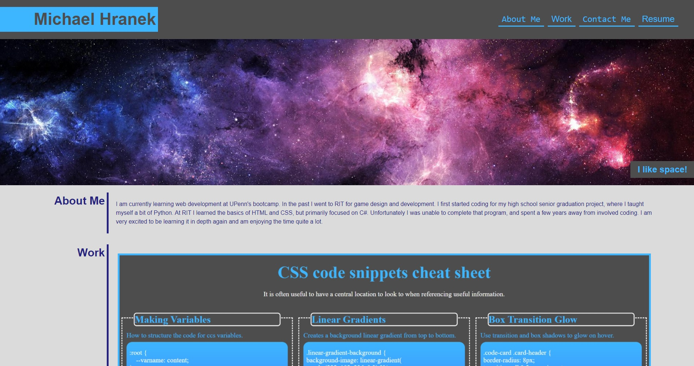

# Michael Hranek's Portfolio

## Description
Having a portfolio of projects is very important for sharing my work to colleagues and potential employers. This will be a location I link to all my presentable/completed projects, as well as contact links.

## Installation
This page is hosted on GitHub Pages, at https://mhranek.github.io/Portfolio/ and the files are accessable from my personal GitHub account https://github.com/MHranek/Portfolio.

## Usage
The navigation bar at the top links to each section of the page, as well as my resume(not yet implemented). Within the 'Work' section each panel links to the respective project(there is only one so far) and 'Contact Me' provides ways to reach me(not fully implemented) as well as my GitHub page.

## Credits
https://www.manypixels.co/gallery clip art images